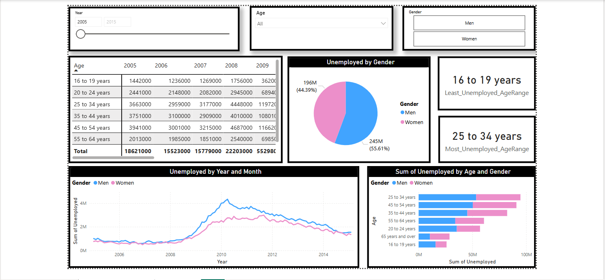

# 📊 **Unemployment Analysis Dashboard - Power BI**  

## 🚀 **Project Overview**  
This **Power BI dashboard** provides an interactive and visual representation of **unemployment trends** across different **age groups and genders** over multiple years. The goal of this project is to analyze labor market patterns, identify trends, and extract actionable insights using **data visualization techniques**.  

## 📌 **Key Features**  
✅ **Interactive Filters** – Users can filter data by **Year, Age Group, and Gender** for detailed analysis.  
✅ **Trend Analysis Chart** – Line chart showing **unemployment trends over time**, categorized by gender.  
✅ **Unemployment Breakdown** – Pie chart illustrating **gender distribution** of unemployment.  
✅ **Bar Chart Representation** – Comparison of unemployment across **different age groups and genders**.  
✅ **Data Table with Totals** – Displays unemployment data from **2012 to 2015** with aggregate values.  
✅ **Key Insights Cards** – Highlighting the **most** and **least** unemployed age ranges.  

## 📈 **Insights from the Dashboard**  
📌 The **25 to 34 years** age group has the **highest unemployment**.  
📌 The **16 to 19 years** age group has the **lowest unemployment**.  
📌 Unemployment peaked around **2010** and started **declining afterward**.  

## 🛠 **Tech Stack Used**  
- **Power BI** – Data visualization and interactive dashboard creation  
- **Excel/CSV Dataset** – Data preprocessing and transformation  
- **DAX (Data Analysis Expressions)** – For calculations and insights  

## 🖼 **Project Screenshots**  
### 📌 **Dashboard Overview**  
  

## 📂 **Dataset Information**  
- **Source:** [Specify Dataset Source or "Sample Data"]  
- **Columns:** Year, Age Group, Gender, Number of Unemployed  
- **Data Range:** 2012 - 2015  

## 🏁 **How to Use This Project**  
1. Clone this repository:  
   ```bash
   git clone https://github.com/Pratik1Bhuwad/Unemployment-Analysis-Dashboard---Power-BI-Project.git
   ```
2. Open the **Power BI (.pbix) file** in **Power BI Desktop**.  
3. Explore the **interactive visuals, filters, and insights**.  

## 📢 **Let's Connect!**  
If you find this project interesting or have suggestions for improvements, feel free to connect! 🚀  

🔗 [LinkedIn](https://www.linkedin.com/in/pratik-bhuwad-a62576293/)  

## ⭐ **Contribute**  
Want to improve this dashboard? Fork this repository, make enhancements, and submit a **pull request**!  

**📌 Don't forget to ⭐ the repo if you find it useful!**  
